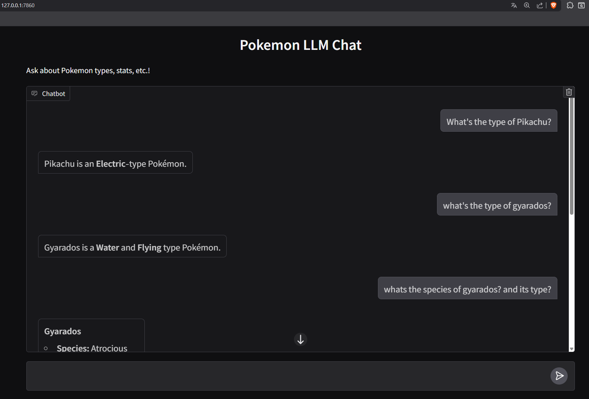

# Pokémon LLM

<p align="center">
	
	
</p>

Welcome to my Pokémon LLM project! This project uses LLMs, along with function calling and a simple interface to help users understand more about pokemons.

---

## 🚀 Features

- **Very simple to set up**
- **Easily deploy a UI on your localhost**
- **Ask multiple questions about diverse pókemon topics**

---

## 🗂️ Project Structure

```text
pokemon_llm/
├── config.yml                # Main configuration file
├── pokemon_venv/             # Python virtual environment
├── src/
│   ├── main.py               # Entry point
│   ├── config/
│   │   └── config.py         # Config loader
│   └── data_extraction/
│       └── data_extractor.py # Data extraction logic
└── README.md                 # This file
```

---

## 🛠️ Setup Instructions

### 1. Clone the repository
```powershell
git clone git@github.com:schrutebeet/pokemon_llm.git
cd pokemon_llm
```

### 2. Create and activate the virtual environment
**Note**: Runs on python >= 3.12.2.
```powershell
python -m venv pokemon_venv
## If on Windows
pokemon_venv\Scripts\Activate.ps1
## If on mac/linux
source pokemon_venv/bin/activate
```

### 3. Install dependencies
```powershell
pip install -r requirements.txt
```

### 4. Run the main script
```powershell
python -m src.main
```

---

## 🧩 Configuration

A `config.yml` Is already definded with the main API URL.

---

## 📝 Example Usage

LLM response without this project's configuration ❌
```markdown
- [USER] What's the type of Iron Crown?
- [SYSTEM] There isn’t a Pokémon officially named “Iron Crown”.
```
LLM response using PokéAPI as base for RAG ✅
```markdown
- [USER] What's the type of Iron Crown?
- [SYSTEM] The Pokémon **Iron Crown** is a **Steel/Psychic** type.
```
---

## 🎨 Screenshots



---

## 🤝 Contributing

If this project is of your interest and you would like to participate, do not hesitate to send your pull requests, issues, and suggestions :)

---

## 📚 Resources

- [PokeAPI](https://pokeapi.co/)
- [Get HuggingFace API token](https://huggingface.co/settings/tokens)

---

## 🏆 License

MIT License © 2025 Ricky

---

> Made with ❤️ for all Pokémon fans and data enthusiasts!
